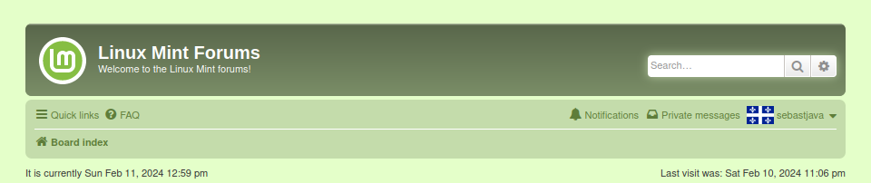
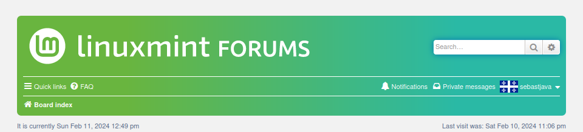

## FreshMint
A new skin for the Linux Mint forums. A real daily experience. Not just screenshots... Not just a showcase... It's real ! Install this new skin today and live better !

It works on Firefox, it works on Chrome, and it works on Android. And, one day, it will work everywhere, when the Linux Mint team integrates code like this on its own servers... 

**before:**
  

**after:**

## Installation

#### Userstyle manager

First, you need a userstyle manager that supports installing UserCSS.

* Stylus for [Firefox](https://addons.mozilla.org/en-US/firefox/addon/styl-us/) or [Chrome](https://chrome.google.com/webstore/detail/stylus/clngdbkpkpeebahjckkjfobafhncgmne) (recommended).
* xStyle for [Firefox](https://addons.mozilla.org/firefox/addon/xstyle/) or [Chrome](https://chrome.google.com/webstore/detail/xstyle/hncgkmhphmncjohllpoleelnibpmccpj).

#### UserCSS file

Open [FreshMint.user.css](https://raw.githubusercontent.com/SebastJava/FreshMint/main/FreshMint.user.css) here in your web browser.

Stylus will open a new tab showing some basic information & options:

* Click on the "Install style" button.
* Click on the "Check for updates" checkbox.

Once installed, you will be redirected to Stylus' editor page with the newly installed/updated UserCSS loaded. Close this if you don't want or need to modify the style.

Now you can see and feel your new https://forums.linuxmint.com

## Troubleshooting

* **Flashing of unstyled content (FOUC):** To avoid this, click on the Stylus Options (gear icon). In the "Advanced" section, turn on the "Instant inject mode".