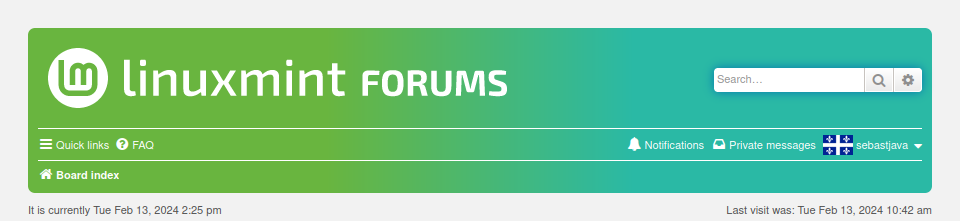
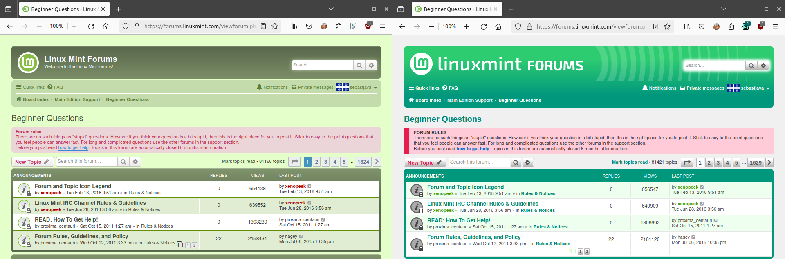
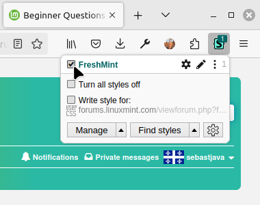
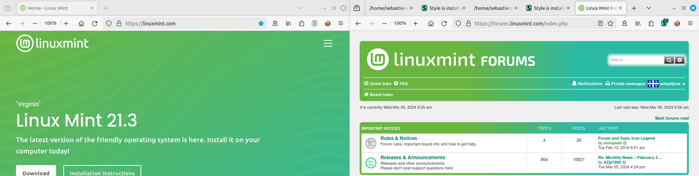
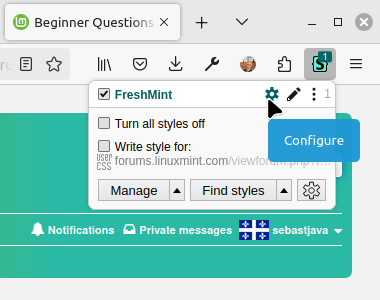
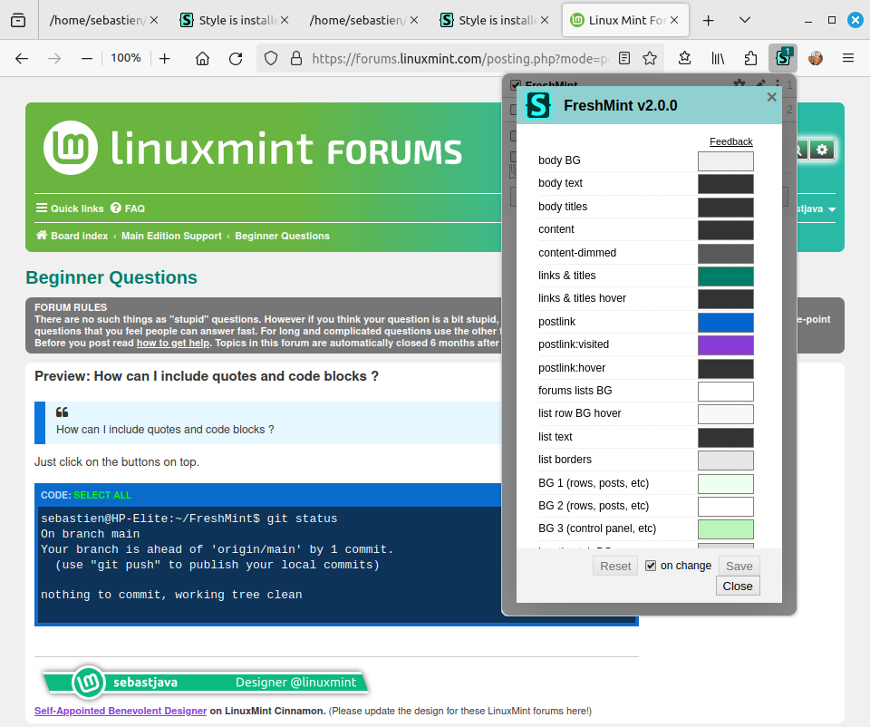

## FreshMint

A new skin for the Linux Mint Forums!  
Not just screenshots... Not just a showcase...  

Start wearing this new skin today and start living better!  

It works on Firefox and Chrome.  
It works on your computer.  
It works on Android too.  

And it would work on all browsers and all systems if the Linux Mint team chose to install this FreshMint on their servers...

**before:**
  

**after:**

## Installation

#### Userstyle manager

First, you need a userstyle manager that supports installing UserCSS.

* Stylus for [Firefox](https://addons.mozilla.org/en-US/firefox/addon/styl-us/) or [Chrome](https://chrome.google.com/webstore/detail/stylus/clngdbkpkpeebahjckkjfobafhncgmne) (recommended).
* xStyle for [Firefox](https://addons.mozilla.org/firefox/addon/xstyle/) or [Chrome](https://chrome.google.com/webstore/detail/xstyle/hncgkmhphmncjohllpoleelnibpmccpj).

#### UserCSS file

Next, open [FreshMint.user.css](https://raw.githubusercontent.com/SebastJava/FreshMint/main/FreshMint.user.css) here in your web browser.

Stylus will then open a new tab showing some basic information & options:

* Click on the "Install style" button.
* Click on the "Check for updates" checkbox.

Once installed, you will be redirected to Stylus editor page with the newly installed/updated UserCSS loaded. Close this if you don't want or need to modify the style.

**Now you can see and feel your new [Linux Mint Forums](https://forums.linuxmint.com)!**

#### A better start (optional)

The default board style on the forums is **Minty**. That's a fork from the standard **Prosilver** style. This **FreshMint** here is build directly on top of that **Prosilver** source.

**If you are in a hurry, don't worry and just skip this step.** All the `colors.css` got duplicated, so this FreshMint should look the same on both Minty and Prosilver. But if you want to make sure everything is 100% accurate, please switch to Prosilver.

Click here to switch to Prosilver

1. [Login](https://forums.linuxmint.com/ucp.php?mode=login&redirect=index.php) or [Register](https://forums.linuxmint.com/ucp.php?mode=register) to the forums.
2. Go to your [User Control Panel](https://forums.linuxmint.com/ucp.php).
3. Click on the **Board preferences** tab and select **prosilver** for your board style.
4. Click on the **Submit** button.

#### Learn more (optional)

You can find more information here:  
https://github.com/openstyles/stylus/wiki/UserCSS

## Compare!

Click here to compare using screenshots or toggle old/new

[FULL SCREEN IMAGE](https://raw.githubusercontent.com/SebastJava/FreshMint/main/screenshots/Minty-vs-FreshMint.png) (press F11)

You can also instantly switch between the old and the new. Click on the Stylus icon, then click on the FreshMint checkbox:

## Color selection rules

Click here to find out where these color choices come from

[FULL SCREEN IMAGE](https://raw.githubusercontent.com/SebastJava/FreshMint/main/screenshots/website-vs-forums.png) (press F11)

#### Color gradient

This color gradient has the exact same colors as those found on the main website. We all agree there should be some consistency all across the different Linux Mint websites. But the page-header here on FreshMint is much smaller than the one on the [main website](https://linuxmint.com/). So, i find it works better here with a 90° angle and different starting and ending points: `linear-gradient(90deg, #69B53F 33%, #2AB9A5 67%)`.

Anyway, i turned this into a text variable, so you can quickly try anything you want. [Experiment with colors and styles!](https://github.com/SebastJava/FreshMint?tab=readme-ov-file#experiment-with-colors-and-styles)

#### A word about these blue links (anchors)

These blue links (`#0046CD` as of 2024-02-15) have color contrasts greater than 7 on white or extra-light backgrounds such as `#F8F8F8` and `#EFFFEF`. This means it is easily readable by anyone at any size.

I was unable to find such excellent color contrasts with a green color that would fit this theme and be noticeable. Anyway, the current color palette is based on a gradient that goes from yellowish green to blueish green. So, there is some sort of color harmony here. That's analogous colors. It fits.

On top of that, the blue color is the standard color code for HTML links. This way, newbies won't be lost...

Anyway, i knew this would be controversial, so i turned this into a variable so you can instantly try any color. [Experiment with colors and styles!](https://github.com/SebastJava/FreshMint?tab=readme-ov-file#experiment-with-colors-and-styles)

**References:**  
https://colorable.jxnblk.com  
https://www.w3.org/TR/UNDERSTANDING-WCAG20/visual-audio-contrast-contrast.html  

## Experiment with colors and styles!

This theme is based on UserCSS. There are some variables you can instantly try and see. Click on the Stylus icon, then click on the FreshMint gear icon.

Click here to see how

You will then get a control panel where you can instantly change some CSS variables:

## Everything got redesigned

The page header is the first thing people will see and thus it is very important. Extra care was taken on this page header. But there is much more than this here. Everything was looked at and readjusted.

* a communicative design
* sufficient contrasts
* colors that echo the main website

And then the extra coding was reduced to very little. So it shouldn't pose too much trouble when the time comes to update the phpBB engine.

## Troubleshooting

* **Flashing of unstyled content (FOUC):** To avoid this, click on the Stylus Options (or gear icon). In the "Advanced" section, turn on the "Instant inject mode".

**If you find a bug or have an issue,** please open a new [issue](https://github.com/SebastJava/FreshMint/issues).