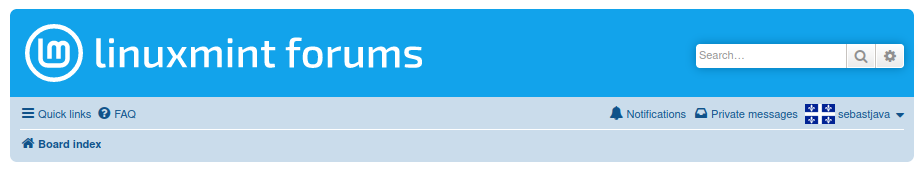

## Preview

## Installation
A userstyle extension is required, common ones include:

🎨 Stylus for [Firefox](https://addons.mozilla.org/en-CA/firefox/addon/styl-us/), [Chrome](https://chrome.google.com/webstore/detail/stylus/clngdbkpkpeebahjckkjfobafhncgmne) or [Opera](https://addons.opera.com/en-gb/extensions/details/stylus/). 
🎨  CSS Override for [Firefox](https://addons.mozilla.org/en-CA/firefox/addon/css-override/).

Then:

📦 [Install the usercss](https://raw.githubusercontent.com/SebastJava/FreshMint/main/FreshMint.user.css). It supports automatic updates. 
