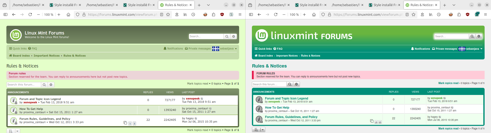
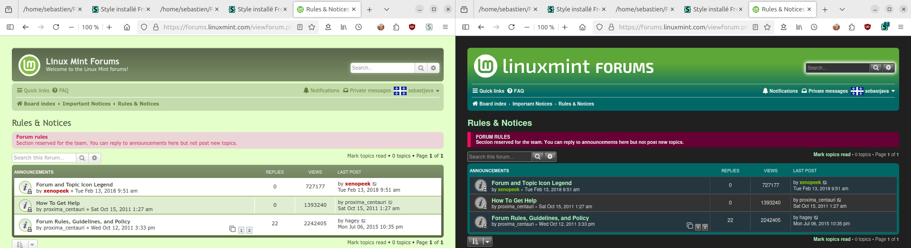

## FreshMint

A new theme for the Linux Mint Forums!  
Not just screenshots... Not just a showcase...  

Start using this new theme today and improve your user experience!  

It works on Firefox and Chrome.  
It works on your computer.  
It works on Android too.  

And it would work on all browsers and all systems if the Linux Mint team chose to install this FreshMint on their servers...

 

 

## Everything got redesigned

The page header is the first thing people will see and thus it is very important. Extra care was taken on this page header. But there is much more than this here. Everything was looked at and readjusted.

* a communicative design
* sufficient contrasts
* nice and professional

And then the extra coding was reduced to very little. So it shouldn't pose too much trouble when the time comes to update the phpBB engine.

But why all this trouble? Find [whats wrong with Minty.](Whats-Wrong-With-Minty.md)

## Installation

#### Userstyle manager

First, you need a userstyle manager that supports installing UserCSS. Choose one of these:

* [Stylus for Firefox](https://addons.mozilla.org/en-US/firefox/addon/styl-us/) (recommended by the Firefox staff)
* [Stylus for Chrome](https://chrome.google.com/webstore/detail/stylus/clngdbkpkpeebahjckkjfobafhncgmne) (recommended by Chrome)

#### UserCSS file

Next, open [FreshMint.user.css](https://raw.githubusercontent.com/SebastJava/FreshMint/main/FreshMint.user.css) or [FreshMint-dark.user.css](https://raw.githubusercontent.com/SebastJava/FreshMint/main/FreshMint-dark.user.css) here in your web browser.

Stylus will then open a new tab showing some basic information & options:

* Click on the "Install style" button.
* Click on the "Check for updates" checkbox.

Once installed, you will be redirected to Stylus editor page with the newly installed/updated UserCSS loaded. Close this if you don't want or need to modify the style.

**Now you can see and feel your new [Linux Mint Forums !](https://forums.linuxmint.com)**

#### A better start (optional)

The default board style on the forums is **Minty**. That's a fork from the standard **Prosilver** style. This **FreshMint** here is build directly on top of that **Prosilver** source.

**If you are in a hurry, don't worry and just skip this step.** All the `colors.css` got duplicated, so this FreshMint should look the same on both Minty and Prosilver. But if you want to make sure everything is 100% accurate, please switch to Prosilver.

1. [Login](https://forums.linuxmint.com/ucp.php?mode=login&redirect=index.php) or [Register](https://forums.linuxmint.com/ucp.php?mode=register) to the forums.
2. Go to your [User Control Panel](https://forums.linuxmint.com/ucp.php).
3. Click on the **Board preferences** tab and select **prosilver** for your board style.
4. Click on the **Submit** button.

#### Learn more (optional)

You can find more information here:  
https://github.com/openstyles/stylus/wiki/UserCSS

## Compare
You can instantly switch between the old and the new. Click on the Stylus icon, then click on the FreshMint checkbox:

## Color selection rules

I don't want to have to choose between pretty or "professional" colors. I try to find colors that are pretty, relevant, well contrasted, and not stressful on the eyes. All together.

Bluish greens are naturally better contrasted and less stressful. And they still look good when reduced in saturation or brightness. And then it fits more with the definition of mint green, in my humble opinion.

But we can allow for a few exceptions. The logo should be more vibrant, more attractive. There is no need for subdued colors for the logo.

#### References

> A contrast ratio of 3:1 is the minimum level recommended by [ISO-9241-3] and [ANSI-HFES-100-1988] for standard text and vision. The 4.5:1 ratio is used in this provision to account for the loss in contrast that results from moderately low visual acuity, congenital or acquired color deficiencies, or the loss of contrast sensitivity that typically accompanies aging.  
> source: https://www.w3.org/TR/UNDERSTANDING-WCAG20/visual-audio-contrast-contrast.html

https://colorable.jxnblk.com  
https://marijohannessen.github.io/color-contrast-checker/  
https://uxmovement.com/content/why-you-should-avoid-bright-saturated-background-colors/  
https://uxmovement.com/content/why-you-should-never-use-pure-black-for-text-or-backgrounds/  
https://flatuicolors.com/  

## Experiment with colors and styles

This theme is based on UserCSS. There are some variables you can instantly try and see. Click on the Stylus icon, then click on the FreshMint gear icon.

You will then get a control panel where you can instantly change some CSS variables:

## Forum signatures

There are also new signatures for members of the Linux Mint community. A signature is a signature. The style should stand out a little: [LM-forums-signatures](https://github.com/SebastJava/LM-forums-signatures)

## Troubleshooting

* **Flashing of unstyled content (FOUC):** To avoid this, click on the Stylus Options (or gear icon). In the "Advanced" section, turn on the "Instant inject mode".

**If you find a bug or have an issue,** please open a new [issue](https://github.com/SebastJava/FreshMint/issues).
